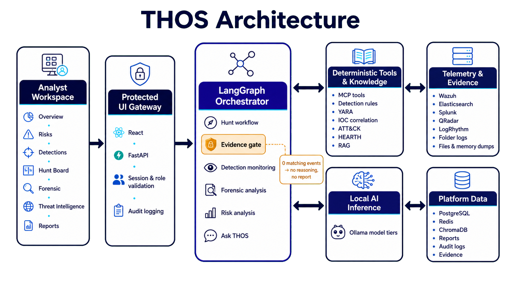

# THOS - Threat Hunting Operating System

THOS is a security operations platform for hypothesis-driven
threat hunting, detection monitoring, digital forensics, threat-intelligence
correlation, risk analysis, and evidence-backed reporting.

It combines evidence-integrity controls and security tools with local
agent-model planning and reasoning. Live
telemetry and submitted evidence are collected and normalized first; model
reasoning is used only when the evidence gate finds relevant events or other
supported signals.

## Product capabilities

- Operations dashboard with selectable time periods, security-impact KPIs,
  operational-efficiency statistics, workload health, and recent activity.
- Actionable Risks page that consolidates verified detections and hunt findings,
  scores them, records their age and affected entity, exports the result, and
  links back to the source investigation.
- Detection Monitoring with unique detection identifiers, source-event
  evidence, and expandable AI analysis.
- Searchable Hunt Board backed by HEARTH hypotheses, locally authored
  hypotheses, ATT&CK mappings, prior-run metadata, and live timestamped agent
  progress.
- Deterministic evidence screening: a hunt with no detection-rule, artifact,
  IOC, behavioral, or matching-event evidence stops before expensive
  reasoning and does not create a report.
- Evidence-file forensic examination with hashing, chain-of-custody metadata,
  artifact analysis, event timelines, ATT&CK mappings, proven facts, and
  unresolved anomalies.
- File and memory analysis for suspicious files, executables, documents,
  archives, full-memory images, process dumps, and other artifacts using the
  managed YARA catalog.
- Threat-intelligence source management and local IOC correlation.
- Hunt and forensic report libraries with search, time-period selection,
  Markdown download, and styled PDF export.
- Editable hypothesis, detection-rule, YARA, and IOC-refresh schedules for
  authorized administrators and SMEs.
- Governed SIEM and direct-security-source integrations with connection tests,
  schema discovery, and source attribution.
- Timestamped audit logs for requests, authentication, hunts, detections,
  forensic operations, configuration changes, and tool activity.
- Searchable in-product Help, protected browser URLs, local users, roles, and
  feature permissions.
- Read-only Ask THOS assistance with specialist delegation for hunt and
  forensic questions.

## Architecture

<p align="center">
  
</p>

The primary request path is:

1. An authenticated analyst uses the React workspace through the FastAPI UI
   gateway.
2. The gateway validates the signed session, role, feature permission, route,
   and request before forwarding an operation.
3. The LangGraph orchestrator coordinates specialist agents, governed tools,
   telemetry retrieval, local knowledge, and Ollama model tiers.
4. Connectors retrieve bounded evidence from the selected source. Evidence is
   normalized, deduplicated, guarded, correlated, and checked for coverage.
5. The evidence gate ends zero-signal hunts without model reasoning or report
   generation.
6. Evidence-bearing hunts continue through bounded reasoning, deterministic
   citation verification, detection engineering, communication, and report
   creation.
7. PostgreSQL stores operational and audit state, Redis provides caching and
   scheduling coordination, ChromaDB provides local semantic retrieval, and
   managed directories retain evidence and reports.

### Runtime services

| Service | Responsibility |
|---|---|
| `chat-ui` | React application, protected routes, session gateway, report rendering, and PDF export |
| `orchestrator` | Authenticated APIs, LangGraph hunt execution, scheduling, risk analysis, forensics, and Ask THOS |
| `mcp` | Governed security tools, knowledge operations, parsing, correlation, and report access |
| `ollama` | Local model inference with configurable task tiers |
| `chromadb` | Local vector storage for product, ATT&CK, HEARTH, SIEM, and private knowledge |
| `postgres` | Hunt history, agent timings, cases, feedback, detections, and audit records |
| `redis` | Query/telemetry cache, locks, rate limits, schema cache, and scheduler coordination |
| corpus initializers | Pin, validate, and prepare detection-rule and YARA catalogs before dependent services start |

Only the analyst UI is published by default. Orchestrator, MCP, Ollama,
ChromaDB, PostgreSQL, and Redis remain on the internal Docker network.

## Application areas and URLs

Each primary area has a validated browser URL. Direct navigation and browser
back/forward operations remain protected by the session and authorization
checks.

| Area | URL | Purpose |
|---|---|---|
| Overview | `/overview` | Daily operational and security-impact dashboard |
| Risks | `/risks` | Prioritized risks derived from verified operational evidence |
| Detections | `/detections` | Detection Monitoring and expandable analysis |
| Hunt Board | `/hunt-board` | Hypothesis selection and live hunt execution |
| Forensic evidence | `/forensic/evidence` | Evidence intake and technical forensic reports |
| File and memory analysis | `/forensic/yara` | YARA analysis of suspicious artifacts and dumps |
| Threat Intelligence | `/threat-intelligence` | IOC catalog, freshness, and source status |
| Reports | `/reports` | Hunt and forensic report library |
| Integrations | `/integrations` | SIEM and direct-source connections |
| Configuration | `/configuration/account` | Account, runtime, rules, schedules, audit, knowledge, and users |
| Help | `/help` | Searchable feature and configuration guidance |

Validated detail routes are also available for detections, hunts, forensic
cases, file/memory scans, reports, and configuration tabs.

## Hunt workflow

The current hunt graph is:

```text
Knowledge refresh
  -> Hypothesis selection
  -> Hunt memory
  -> Supervisor plan
  -> Query generation
  -> SIEM retrieval
  -> Log processing and normalization
  -> Guardrails
  -> Detection and evidence tools
  -> ATT&CK coverage analysis
  -> Threat-intelligence enrichment
  -> Supervisor-directed adaptive retrieval
  -> Negative evidence screening
      -> no supported evidence: stop; retain hunt outcome; create no report
      -> supported evidence: local reasoning
  -> Citation verification
  -> Detection-engineering proposal
  -> Audience-aware communication
  -> Evidence-backed report
```

Only one hunt runs at a time. The active-hunt banner opens the timestamped
progress view. Hunts continue on the server if the browser reloads or navigates
away.

Related hunts can reuse identical validated telemetry retrievals by ATT&CK
technique and time window.
Detection Monitoring can use bounded multi-search batches where supported.
The Schedule Planning Agent orders overdue work, uses recorded duration
percentiles, and selects a batch that fits the maintenance window and current
model, queue, and source capacity.

When relevant evidence exists but the reasoning model returns malformed output,
THOS makes up to three bounded attempts. If they all fail, the current
implementation records the model failure and creates no report. THOS does not
substitute a static technique-specific conclusion for a failed analyst model.

## Telemetry integrations

### SIEM and log sources

| Source | Retrieval path |
|---|---|
| Folder evidence | Recursive parsing under an allowlisted server directory |
| Wazuh | Wazuh Indexer/OpenSearch search API |
| Elasticsearch | Elasticsearch search API |
| Splunk Enterprise or Cloud | REST search-job API |
| IBM QRadar | Ariel Search API |
| LogRhythm | Search API |

Mock telemetry exists only for isolated tests and is rejected unless
`ALLOW_SYNTHETIC_TELEMETRY=1` is explicitly set.

The integration catalog also covers governed direct sources across EDR/XDR,
identity, cloud, email/SaaS, network/NDR, and generic JSON APIs. A live source
must pass its connection test before it becomes available to hunts or
schedules.

### Wazuh

THOS searches Wazuh security events through the Indexer API, normally on TCP
`9200`; it does not use the Wazuh manager API on TCP `55000`.

```dotenv
WAZUH_INDEXER_URL=https://host.docker.internal:9200
WAZUH_INDEXER_USERNAME=<read-only-indexer-user>
WAZUH_INDEXER_PASSWORD=<password>
WAZUH_INDEX_SOURCE=both
WAZUH_VERIFY_SSL=1
WAZUH_CA_BUNDLE=/path/to/wazuh-root-ca.pem
```

`WAZUH_INDEX_SOURCE=both` searches both `wazuh-alerts-*` and
`wazuh-archives-*`. Disable TLS verification only in an isolated test
environment that uses a self-signed certificate.

### Folder formats

Folder-backed hunts support:

| Logs and records | Packet captures |
|---|---|
| EVTX, CSV, CEF, JSON, ECS, JSONL, NDJSON, XML | PCAP and PCAPNG |
| Syslog, `.log`, and plain text | Parsed into bounded normalized records |

The default folder is:

```text
data/log_sources/
```

Caller-provided folders are resolved against `LOG_SOURCE_ALLOWED_ROOTS` to
prevent arbitrary filesystem access.

## Digital forensics

The Forensic page has two analysis paths.

### Evidence examination

- Accepts multiple logs, packet captures, archives, documents, disk images, and
  other case evidence.
- Streams uploads to managed case storage and records SHA-256, size, original
  name, stored name, collector/tool, authority, and acquisition notes.
- Verifies evidence integrity before analysis.
- Profiles artifacts by content, parses supported logs, inventories archives
  without unsafe extraction, and gives those facts to the Forensic Planning
  Agent.
- Runs only the planner-selected available tools, then performs a second
  planning pass over the first-pass results to decide whether memory, disk,
  executable, or document analysis is still required.
- Bundles YARA, capa with pinned rules, FLOSS, pefile, GNU strings, ExifTool,
  ClamAV, oletools, Volatility 3, RegRipper, libewf, The Sleuth Kit, and safe
  PDF/document parsers in the forensic worker.
- Correlates selected tool results and local intelligence as evidence facts;
  the Forensic Interpretation Agent owns the final cited assessment.
- Produces an ordered timeline, ATT&CK mappings, proven facts, unresolved
  anomalies, limitations, and chain-of-custody details.

### File and memory analysis

- Accepts PE/ELF executables, DLLs, scripts, documents, archives, raw/VM/LiME
  memory images, core files, minidumps, and process dumps.
- Hashes and preserves the original artifact before scanning.
- Routes PE/ELF, PDF, Office/OLE, registry, disk, memory, and generic files to
  model-selected applicable tools. The dedicated YARA action remains an
  explicit analyst-requested scan.
- Shows each selected tool's duration, structured output, limitations,
  truncation state, and evidence observations.
- Treats a no-match result as inconclusive rather than proof that an artifact
  is benign.

Local tool processes use fixed argument arrays without a shell, per-tool
timeouts, and output caps. Submitted samples are never executed by the THOS
worker. The Forensics page lists only tools installed in the worker image.

See [docs/FORENSIC-TOOLS.md](docs/FORENSIC-TOOLS.md) for the capability matrix,
resource controls, network allowlist, directory mapping, and validation steps.

## Detection Monitoring and YARA

THOS maintains governed, version-pinned detection-rule and YARA corpora.
Initializer services validate minimum counts and compile reusable catalogs
before MCP and the orchestrator become ready.

Detection rules are discovered, compiled, and executed against compatible SIEM
schemas without requiring a language model. Incompatible or unmapped rules
remain visible and fail closed. Wazuh and Splunk support the current scheduled
native-query pipeline; unsupported scheduled compiler paths are not
approximated.

YARA rules can be searched, filtered, enabled, disabled, scanned manually, and
scheduled. Invalid or unsupported community files are cataloged with their
compiler errors rather than silently treated as active.

Detection entries receive stable identifiers. Authorized users can expand or
collapse a concise AI-assisted explanation beside the detection name; the
underlying event evidence remains the source of truth.

## Reports, risks, and auditability

Hunt reports begin with a concise summary and contain only investigation
content: hypothesis and scope, executed queries, retrieval results,
representative evidence, record references, findings, ATT&CK coverage,
intelligence correlation, limitations, recommendations, and draft detection
improvements. Platform audit, model, cache, case, and workflow details remain
in operational views and are not included in hunt reports.

Forensic reports additionally include chain of custody, proven facts,
unresolved anomalies, technical timelines, and evidence integrity.

The Reports page supports dynamic age filters from days to years. Report
previews provide Markdown and PDF downloads without obscuring the preview
controls.

The Risk Analysis Agent consolidates verifier-supported findings and detections
into entity-level risks. Each risk includes a score, severity, age, discovery
explanation, evidence source, export support, and a link to its originating
detection or report.

Risk results are materialized after reports and positive detections are
persisted, so Overview and Risks load without waiting for model inference and
refresh automatically from the latest evidence. Per-agent local-model routing,
server-aware recommendations, and forensic/hunt performance controls are
documented in
[`docs/PERFORMANCE-AND-AGENT-MODEL-ROUTING.md`](docs/PERFORMANCE-AND-AGENT-MODEL-ROUTING.md).

Audit logs record timestamps, actor, action, outcome, request context, and
workflow identifiers to support troubleshooting and reconstruction.

## Security boundaries

- Local Ollama inference; no cloud model API is required.
- Signed HttpOnly sessions and server-side role/feature enforcement.
- Validated stable routes and constrained dynamic identifiers.
- API-key authentication between internal services.
- Read-only SIEM and security-source operations.
- Allowlisted evidence roots and bounded parsing.
- Prompt-injection screening and telemetry guardrails.
- Deterministic record-reference verification before findings are published.
- No autonomous host isolation, traffic blocking, evidence deletion, live-rule
  deployment, or attribution.
- No reasoning or report generation when the deterministic evidence gate finds
  no supported evidence.

Secrets and password hashes are stored in the runtime configuration under
`data/runtime/config.json`. Treat this file as a secret, restrict filesystem
access, and back it up through an approved secure process.

## Technology

| Layer | Technology |
|---|---|
| Analyst interface | React, Vite |
| API gateway and services | FastAPI, Python 3.12+ |
| Agent orchestration | LangGraph |
| Governed tool interface | FastMCP |
| Local inference | Ollama |
| Semantic retrieval | ChromaDB |
| Operational database | PostgreSQL |
| Cache and coordination | Redis |
| Deployment | Docker Compose |
| Security knowledge | MITRE ATT&CK, HEARTH, managed private knowledge |

## Requirements

Minimum starting point for a small deployment:

- 8 x86-64 CPU cores
- 16 GB RAM
- 50 GB free SSD space
- Docker Engine with Docker Compose

Recommended starting point for concurrent daily operations:

- 12-16 CPU cores
- 32 GB RAM
- 100 GB or more SSD space
- Supported GPU with 8-12 GB VRAM for the reasoning model

Actual sizing depends on model size, telemetry volume, evidence retention,
forensic artifacts, schedule density, and the available maintenance window.

## Quick start

```bash
git clone <repository-url>
cd AI-Threat-Hunting-Docker
cp env.example .env
docker compose up -d --build
```

Review and replace every placeholder credential in `.env` before exposing the
service. Then open:

```text
http://localhost:7860
```

Check service status:

```bash
docker compose ps
docker compose logs --tail=100 chat-ui orchestrator mcp
```

The default production-safe telemetry mode is `folder`. Configure and
successfully test a live source from Integrations before selecting it for hunts
or schedules.

## Configuration

`env.example` documents deploy-time settings. Operational settings are managed
through the Configuration page:

- My account
- General runtime and model settings
- Detection rules
- YARA rules
- IOC sources
- Hunt and rule schedules
- Audit logs
- Private knowledge
- Users and roles

Admin and SME users can edit operational schedules. Admin users additionally
control users, roles, and destructive administrative actions. Expert access is
limited to explicitly assigned features.

## Network allowlist

Allow only the services that are enabled:

| Purpose | Destination | Port |
|---|---|---|
| Analyst access | THOS host | TCP 7860 |
| Reviewed corpus refresh | `github.com`, `codeload.github.com`, `objects.githubusercontent.com`, `raw.githubusercontent.com` | TCP 443 |
| Built-in IOC feeds | `openphish.com`, `feodotracker.abuse.ch`, `check.torproject.org`, `feeds.dshield.org`, `raw.githubusercontent.com` | TCP 443 |
| Optional Ollama model download | `registry.ollama.ai` | TCP 443 |
| Wazuh or Elasticsearch | Configured private host | TCP 9200 by default |
| Splunk | Configured private host | TCP 8089 by default |
| QRadar | Configured private host | TCP 443 by default |
| LogRhythm | Configured private host | TCP 8505 by default |

Internal DNS and NTP must also be available. Custom feeds and direct
integrations require only their explicitly configured hostnames. THOS requires
no unsolicited inbound Internet access.

For air-gapped operation, pre-stage Ollama model blobs, ATT&CK/HEARTH content,
the detection-rule and YARA corpora, IOC snapshots, and trusted CA
certificates. Disable refresh schedules that cannot reach an approved internal
mirror.

## Testing

Run the Python regression suite:

```bash
python -m pytest -q
```

Build the analyst UI:

```bash
cd services/ui
pnpm install
pnpm build
```

Agent-specific test modes:

```powershell
.\scripts\test-agents.ps1 contracts
.\scripts\test-agents.ps1 offline
.\scripts\test-agents.ps1 full
.\scripts\test-agents.ps1 live
```

Additional references:

- [Developer guide](THOS-Developer-Guide.md)
- [Agent testing](docs/AGENT-TESTING.md)
- [Enterprise regression results](docs/ENTERPRISE-REGRESSION-2026-07-28.md)
- [Cybersecurity model adaptation](docs/CYBERSECURITY-MODEL-ADAPTATION.md)

## Contributing

Contributions are welcome. Preserve the evidence-first security boundaries,
fail-closed connector behavior, citation verification, and auditability when
adding connectors, agents, parsers, or UI workflows.

## License

THOS 1.0 is source-available under the **Business Source License 1.1
(BUSL-1.1)**.

You may use, copy, modify, and self-host THOS for your own internal purposes.
You may not commercially exploit THOS or offer it, or a modified version, as a
hosted or managed service to third parties without a separate commercial
license from Prasannakumar B Mundas.

Each THOS release changes to the **Apache License 2.0** four years after that
release first becomes publicly available. See [LICENSE](LICENSE) for the
controlling terms.

This licensing applies to the original THOS work. Third-party components and
datasets remain governed by their respective licenses.

## Acknowledgements

THOS builds on Ollama, LangGraph, FastMCP, ChromaDB, FastAPI, React, Vite,
PostgreSQL, Redis, Docker, MITRE ATT&CK, HEARTH, and the respective
community-maintained detection and YARA projects.

## Disclaimer

THOS is intended for authorized security monitoring, threat hunting, incident
response, and cybersecurity research. Users are responsible for compliance
with applicable law, organizational policy, evidence-handling requirements,
and third-party licenses.
