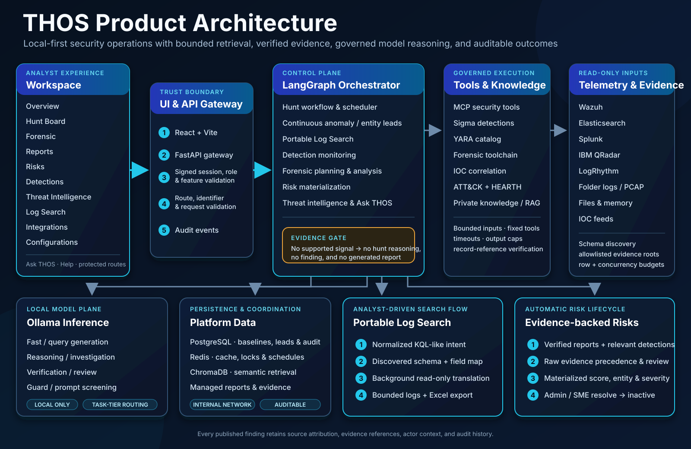

# THOS — Threat Hunting Operating System

THOS is a local-first security operations platform for evidence-driven threat
hunting, log investigation, detection monitoring, digital forensics, risk
management, threat-intelligence correlation, and reporting.

It combines deterministic security controls with locally hosted agent models.
Telemetry and submitted evidence are collected, normalized, bounded, and
verified before model reasoning is allowed to produce a finding or report.
When the evidence does not support a conclusion, THOS records the outcome
without manufacturing one.

<p align="center">
  
</p>

The primary request path moves from the protected analyst workspace through the
UI/API gateway into the orchestrator. Governed tools retrieve and validate
read-only evidence before local model reasoning is allowed. Log Search and risk
materialization use the same source schemas, field mappings, evidence controls,
and auditable platform state shown in the diagram.

## Product at a glance

| Workspace | What analysts can do |
|---|---|
| **Overview** | Monitor security-impact KPIs, operating efficiency, service health, workload status, and recent activity for a selected period. |
| **Hunt Board** | Search HEARTH and locally authored hypotheses, inspect ATT&CK mappings and run history, launch hunts, and follow timestamped agent progress. |
| **Forensic** | Upload and preserve evidence, examine logs and artifacts, run file or memory analysis, build timelines, and generate evidence-backed forensic reports. |
| **Reports** | Search hunt and forensic reports, filter by age, preview the investigation, and download Markdown or styled PDF. |
| **Risks** | Review automatically materialized risks, filter by period or state, inspect evidence and affected entities, export results, and resolve risks as an Admin or SME. |
| **Detections** | Review scheduled detections, unique detection IDs, matched source events, and expandable AI-assisted analysis. |
| **Threat Intelligence** | Manage IOC sources, monitor freshness, search local indicators, and correlate intelligence with evidence. |
| **Log Search** | Write a portable correlation intent, automatically translate it for the selected SIEM, retrieve read-only logs, and download the result as Excel. |
| **Integrations** | Configure governed SIEM and direct security-source connections, test connectivity, and discover source schemas. |
| **Configurations** | Manage the account, runtime, model routing, rules, schedules, audit logs, knowledge, users, roles, and permissions. |

Ask THOS is available as a read-only assistant for security questions and can
delegate bounded work to hunt and forensic specialists.

## Core capabilities

- Evidence-first, hypothesis-driven hunts mapped to MITRE ATT&CK.
- Automatic SIEM field discovery, normalized field mappings, safe query
  generation, bounded retrieval, and record-reference validation.
- A SIEM-neutral manual Log Search workspace with background translation and
  Excel export.
- Automatically refreshed, entity-level risks derived only from verified hunt
  findings and relevant positive detections.
- Persistent risk resolution: Admin and SME users can mark a risk resolved,
  moving it to the inactive state without deleting its history.
- Governed Sigma and YARA catalogs with scheduled and analyst-initiated
  execution.
- Evidence preservation, SHA-256 integrity checks, chain of custody, static
  artifact analysis, memory analysis, timelines, and forensic reporting.
- Local threat-intelligence ingestion and IOC correlation.
- Protected stable browser routes, signed sessions, roles, feature permissions,
  and timestamped audit events.
- Local Ollama model routing for fast, reasoning, verification, coding, and
  guard tasks; no cloud model API is required.

## Application routes

The main menu and protected routes follow the same order as the analyst
workflow.

| Menu item | Route | Access |
|---|---|---|
| Overview | `/overview` | Authenticated users |
| Hunt Board | `/hunt-board` | Users with hunt access |
| Forensic | `/forensic/evidence` and `/forensic/yara` | Users with forensic access |
| Reports | `/reports` | Users with report access |
| Risks | `/risks` | Users with risk access |
| Detections | `/detections` | Users with detection access |
| Threat Intelligence | `/threat-intelligence` | Users with intelligence access |
| Log Search | `/log-search` | Users with log-search access and an active telemetry source |
| Integrations | `/integrations` | Admin and SME |
| Configurations | `/configuration/account` | Feature and role dependent |

Direct navigation and browser back/forward operations remain protected by the
same session, role, feature, route, and identifier validation used by the API.

## Portable Log Search

Log Search is designed for analysts who need to build and test correlation
queries manually without learning a different query language for every SIEM.

1. THOS selects the current default telemetry source, or the analyst selects
   another active source.
2. The page loads the source's normalized field mappings and cached discovered
   schema.
3. The analyst enters a normalized KQL-like expression or a concise plain
   language intent.
4. Selecting **Search** translates the intent in the background into the
   selected source's read-only syntax, validates it, executes it with the
   selected lookback and row limit, and displays normalized records.
5. **Download Excel** exports all returned rows and the search metadata to an
   `.xlsx` workbook.

Examples:

```text
process_name == "powershell.exe" and command_line contains "-enc"
source_ip == "10.0.0.15" and destination_port == "445"
message contains "nmap"
```

Plain language is also accepted:

```text
Find the same user authenticating from multiple source IPs followed by privileged process execution.
```

The portable expression is not vendor KQL. It is a normalized analyst intent
that THOS grounds against available fields before generating one of these
target forms:

| Source | Generated form |
|---|---|
| Wazuh | OpenSearch query DSL |
| Elasticsearch | Elasticsearch query DSL |
| Splunk | SPL |
| IBM QRadar | AQL |
| LogRhythm | LogRhythm filter syntax |
| Folder evidence | Bounded keyword retrieval |

Field meaning matters. For Wazuh, `rule_description` maps to
`rule.description`, while normalized `message` maps to the raw `full_log`
content. Therefore, use `message contains "nmap"` when the keyword appears in
the raw event rather than in the Wazuh rule description.

Generated vendor syntax is intentionally kept out of the normal search
workflow. Queries are read-only, bounded, validated against the selected
source, and rejected when they are unsafe or cannot be grounded.

## Risks

The Risks page is a materialized view of evidence-backed security exposure; it
is not a count of every report or detection record.

THOS automatically refreshes the snapshot after verified hunt reports and
positive scheduled detections are persisted, and again when the orchestrator
starts. Existing materialized values remain immediately available while a new
snapshot is built.

Risk eligibility follows these controls:

- Only reports that passed deterministic citation verification, completed with
  model reasoning, and generated successfully can seed a live risk.
- Explicitly negative findings such as “no evidence observed” are not risk
  candidates.
- Raw scheduled-detection records take precedence over rule titles, triage
  summaries, and prior model text.
- Broad or unrelated detection matches are rejected when their raw records do
  not support the detection rule.
- The model owns the evidence-grounded eligibility, explanation, affected
  entity, likelihood/impact score, and severity; deterministic code validates
  references, entity grounding, schema, and score consistency.

Each risk includes:

- risk ID, name, description, score, and severity;
- active or inactive state;
- affected entity;
- what happened, why it matters, and how it was discovered;
- source type, source identifier, evidence references, and last-seen time;
- a link to the originating report or detection where available.

Analysts can select 1, 7, 14, 30, 90, 180, or 365 days, or all time, and can
filter active, inactive, or all states. Admin and SME users can resolve an
active risk. Resolution is stored in PostgreSQL with the actor, timestamp, and
note; the risk becomes inactive and remains auditable.

## Threat-hunting workflow

```text
Knowledge refresh
  -> Hypothesis selection and prior hunt memory
  -> Supervisor plan
  -> Portable query generation and source-specific translation
  -> Bounded SIEM or folder retrieval
  -> Normalization, deduplication, and guardrails
  -> Detection, artifact, IOC, and behavior checks
  -> ATT&CK coverage and intelligence correlation
  -> Adaptive retrieval when supported evidence requires it
  -> Negative-evidence gate
       -> no supported evidence: retain outcome; create no report
       -> supported evidence: local reasoning
  -> Citation and record-reference verification
  -> Detection-engineering proposal
  -> Audience-aware communication
  -> Evidence-backed report
  -> Automatic risk refresh
```

Only one interactive hunt runs at a time. The active-hunt banner opens the live
progress view, and server-side execution continues if the analyst reloads or
navigates away. Identical validated telemetry retrievals can be reused across
related hunts by technique and time window.

If supported evidence exists but a model response is malformed, THOS performs
bounded retries. A persistent model failure is recorded and no static or
technique-specific conclusion is substituted.

## Digital forensics

### Evidence examination

- Streams submitted evidence to managed case storage and records original
  name, stored name, SHA-256, size, collector/tool, authority, and acquisition
  notes.
- Verifies integrity before analysis.
- Profiles content, parses supported logs, safely inventories archives, and
  presents deterministic facts to the Forensic Planning Agent.
- Uses a second planning pass to decide whether additional memory, disk,
  executable, registry, or document analysis is warranted.
- Produces proven facts, unresolved anomalies, an ordered timeline, ATT&CK
  mappings, limitations, and chain-of-custody information.

### File and memory analysis

THOS supports PE/ELF executables, DLLs, scripts, PDFs, Office/OLE documents,
archives, registry artifacts, raw/VM/LiME memory images, core files, minidumps,
and process dumps. Available tools include YARA, capa, FLOSS, pefile, GNU
strings, ExifTool, ClamAV, oletools, Volatility 3, RegRipper, libewf, The Sleuth
Kit, and safe document parsers.

Tool processes use fixed argument arrays without a shell, per-tool timeouts,
resource limits, and output caps. Submitted samples are preserved but never
executed by THOS. A no-match result is treated as inconclusive, not as proof
that an artifact is benign.

See [Forensic tools](docs/FORENSIC-TOOLS.md) for the detailed capability and
resource-control matrix.

## Detections, YARA, and threat intelligence

THOS maintains version-pinned detection-rule and YARA corpora. Initializer
services validate minimum counts and compile reusable catalogs before dependent
services become ready.

- Compatible Sigma rules are compiled and executed against available SIEM
  schemas without requiring model-generated rule logic.
- Incompatible or unmapped rules remain visible and fail closed.
- Detection records preserve matched source events as the source of truth and
  receive stable identifiers.
- YARA rules can be searched, filtered, enabled, disabled, run manually, and
  scheduled. Invalid community files remain cataloged with compiler errors.
- IOC sources can be refreshed on schedules and correlated locally with hunt
  and forensic evidence.

## Reports and auditability

Hunt reports contain the hypothesis and scope, executed queries, retrieval
results, representative evidence, record references, findings, ATT&CK
coverage, intelligence correlation, limitations, recommendations, and draft
detection improvements.

Forensic reports additionally include evidence integrity, chain of custody,
proven facts, unresolved anomalies, and technical timelines. Reports can be
filtered by age, previewed in the application, and downloaded as Markdown or
PDF.

Platform audit records remain separate from investigation reports. Audit events
include timestamps, actor, action, outcome, request context, and workflow
identifiers for authentication, hunts, detections, forensics, risks,
configuration changes, and governed tool activity.

## Supported telemetry

| Source | Retrieval path |
|---|---|
| Folder evidence | Recursive bounded parsing under an allowlisted server directory |
| Wazuh | Wazuh Indexer/OpenSearch search API |
| Elasticsearch | Elasticsearch search API |
| Splunk Enterprise or Cloud | REST search-job API |
| IBM QRadar | Ariel Search API |
| LogRhythm | Search API |

Folder evidence supports EVTX, CSV, CEF, JSON, ECS, JSONL, NDJSON, XML,
syslog, text logs, PCAP, and PCAPNG. The default path is
`/data/log_sources`, and caller-provided paths must resolve below
`LOG_SOURCE_ALLOWED_ROOTS`.

Synthetic telemetry is restricted to isolated tests and is rejected unless
`ALLOW_SYNTHETIC_TELEMETRY=1` is explicitly configured.

### Wazuh configuration

THOS uses the Wazuh Indexer API, normally on TCP 9200, rather than the Wazuh
manager API on TCP 55000.

```dotenv
SIEM_TYPE=wazuh
WAZUH_INDEXER_URL=https://host.docker.internal:9200
WAZUH_INDEXER_USERNAME=<read-only-indexer-user>
WAZUH_INDEXER_PASSWORD=<password>
WAZUH_INDEX_SOURCE=both
WAZUH_VERIFY_SSL=1
WAZUH_CA_BUNDLE=/path/to/wazuh-root-ca.pem
```

`WAZUH_INDEX_SOURCE=both` searches `wazuh-alerts-*` and `wazuh-archives-*`.
Disable TLS verification only in an isolated environment using a self-signed
certificate; otherwise mount and configure the trusted CA bundle.

## Architecture and runtime services

1. The analyst uses the React workspace through the FastAPI UI gateway.
2. The gateway validates the signed session, role, feature permission, route,
   identifier, and request.
3. The LangGraph orchestrator coordinates specialist agents, governed tools,
   source retrieval, local knowledge, and Ollama model tiers.
4. Connectors retrieve bounded evidence from active sources. Records are
   normalized, deduplicated, guarded, correlated, and verified.
5. PostgreSQL persists operational, risk-resolution, and audit state; Redis
   provides caching and coordination; ChromaDB provides local semantic
   retrieval; managed directories preserve evidence and reports.

| Service | Responsibility |
|---|---|
| `chat-ui` | React application, signed sessions, protected routes, API gateway, report rendering, and export |
| `orchestrator` | Hunt execution, scheduling, Log Search, risk analysis, forensics, and Ask THOS |
| `mcp` | Governed security tools, parsing, correlation, knowledge operations, and report access |
| `ollama` | Local model inference with task-specific routing |
| `chromadb` | Local product, ATT&CK, HEARTH, SIEM, and private-knowledge retrieval |
| `postgres` | Hunts, reports, detections, risks, cases, feedback, and audit state |
| `redis` | Cache, locks, rate limits, schema cache, and scheduler coordination |
| initializer services | Detection-rule and YARA corpus validation and preparation |

Only `chat-ui` is published by default. Internal APIs and data services remain
on the Docker network.

## Security boundaries

- Local inference; no cloud model API is required.
- Signed HttpOnly sessions with server-side role and feature enforcement.
- API-key authentication between internal services.
- Read-only, bounded SIEM and direct-source operations.
- Source schema validation and fail-closed query translation.
- Allowlisted evidence roots and bounded parsing.
- Prompt-injection screening and telemetry guardrails.
- Deterministic evidence and record-reference verification before publication.
- No autonomous host isolation, traffic blocking, evidence deletion,
  live-rule deployment, or attribution.
- No hunt reasoning or report generation when the evidence gate finds no
  supported evidence.

Secrets and password hashes are stored in `data/runtime/config.json`. Treat
that file as a secret, restrict access, and back it up only through an approved
secure process.

## Requirements

Minimum starting point for a small deployment:

- 8 x86-64 CPU cores
- 16 GB RAM
- 50 GB free SSD space
- Docker Engine with Docker Compose

Recommended for concurrent daily operations:

- 12–16 CPU cores
- 32 GB RAM
- 100 GB or more SSD space
- A supported GPU with 8–12 GB VRAM for the reasoning model

Actual requirements depend on model size, telemetry volume, retained evidence,
forensic artifact size, schedule density, and concurrency.

## Quick start

Clone the repository and create the runtime environment file:

```bash
git clone <repository-url>
cd AI-Threat-Hunting-Docker
cp env.example .env
```

On PowerShell, use `Copy-Item env.example .env` instead of `cp`.

Before starting THOS, set unique values for at least:

```dotenv
MCP_AUTH_TOKEN=<random-secret>
ORCHESTRATOR_API_KEY=<random-secret>
CHATUI_USERNAME=<initial-admin-name>
CHATUI_PASSWORD=<strong-password>
CHATUI_SESSION_SECRET=<random-secret>
REDIS_PASSWORD=<random-secret>
POSTGRES_PASSWORD=<random-secret>
```

Generate secrets with an approved password manager or, where available:

```bash
openssl rand -hex 32
```

Start the platform:

```bash
docker compose up -d --build
docker compose ps
```

Open [http://localhost:7860](http://localhost:7860) and sign in with the
configured account.

For initial troubleshooting:

```bash
docker compose logs --tail=100 chat-ui orchestrator mcp
```

The safe default source is `folder`. Configure and successfully test a live
source in **Integrations** before using it for hunts, schedules, or Log Search.

The default local model fleet uses
`hf.co/mradermacher/Foundation-Sec-8B-Instruct-GGUF:Q4_K_M` for security reasoning
and guard-tier work, and
`richardyoung/llama-3.1-8b-instruct-abliterated:Q4_K_M` for fast and query
tasks. The latter intentionally has reduced model-level refusal behavior, so
THOS never assigns it to the guard tier; deterministic input validation,
read-only query enforcement, evidence citation checks, and role authorization
remain authoritative.

The bounded hunt `coverage_gap` and `reasoning` routes use an 8K context so the
Foundation-Sec quant can offload efficiently on an 8 GB GPU. Forensic security
routes retain the 16K cyber profile for larger artifact investigations.

## Operational configuration

`env.example` documents deploy-time secrets, storage, connector, model, and
resource settings. Runtime administration is available under
**Configurations**:

- My account
- General runtime and model settings
- Detection rules and YARA rules
- IOC sources
- Hunt, detection, YARA, and IOC schedules
- Audit logs
- Private knowledge
- Users, roles, and feature permissions

Admin and SME users can manage operational schedules and resolve risks. Admin
users additionally manage users, roles, and destructive administrative
operations. Expert access is restricted to explicitly assigned features.

## Network allowlist

Allow only destinations required by enabled features:

| Purpose | Destination | Default port |
|---|---|---|
| Analyst access | THOS host | TCP 7860 |
| Reviewed corpus refresh | `github.com`, `codeload.github.com`, `objects.githubusercontent.com`, `raw.githubusercontent.com` | TCP 443 |
| Built-in IOC feeds | Configured feed hosts | TCP 443 |
| Optional Ollama downloads | `registry.ollama.ai` | TCP 443 |
| Wazuh or Elasticsearch | Configured private host | TCP 9200 |
| Splunk | Configured private host | TCP 8089 |
| QRadar | Configured private host | TCP 443 |
| LogRhythm | Configured private host | TCP 8505 |

Internal DNS and NTP must also be available. For air-gapped operation,
pre-stage model blobs, ATT&CK and HEARTH content, detection and YARA corpora,
IOC snapshots, and trusted CA certificates, then disable unreachable refresh
schedules or point them at approved internal mirrors.

## Development and testing

Run the Python suite:

```bash
python -m pytest -q
```

Build the analyst UI:

```bash
cd services/ui
pnpm install
pnpm build
```

Agent test modes on PowerShell:

```powershell
.\scripts\test-agents.ps1 contracts
.\scripts\test-agents.ps1 offline
.\scripts\test-agents.ps1 full
.\scripts\test-agents.ps1 live
```

Additional documentation:

- [Developer guide](THOS-Developer-Guide.md)
- [Agent testing](docs/AGENT-TESTING.md)
- [Autonomy and model readiness](docs/AUTONOMY-AND-MODEL-READINESS.md)
- [Cybersecurity model adaptation](docs/CYBERSECURITY-MODEL-ADAPTATION.md)
- [Performance and agent model routing](docs/PERFORMANCE-AND-AGENT-MODEL-ROUTING.md)
- [Forensic tools](docs/FORENSIC-TOOLS.md)

## Contributing

Contributions are welcome. Preserve the evidence-first boundaries,
fail-closed connector behavior, deterministic citation verification, source
attribution, role enforcement, and auditability when adding connectors,
agents, parsers, or UI workflows.

## License

THOS 1.0 is source-available under the **Business Source License 1.1
(BUSL-1.1)**.

You may use, copy, modify, and self-host THOS for your own internal purposes.
You may not commercially exploit THOS or offer it, or a modified version, as a
hosted or managed service to third parties without a separate commercial
license from Prasannakumar B Mundas.

Each THOS release changes to the **Apache License 2.0** four years after that
release first becomes publicly available. See [LICENSE](LICENSE) for the
controlling terms. Third-party components and datasets remain governed by
their respective licenses.

## Acknowledgements

THOS builds on Ollama, LangGraph, FastMCP, ChromaDB, FastAPI, React, Vite,
PostgreSQL, Redis, Docker, MITRE ATT&CK, HEARTH, and community-maintained Sigma
and YARA projects.

## Disclaimer

THOS is intended for authorized security monitoring, threat hunting, incident
response, digital forensics, and cybersecurity research. Users are responsible
for compliance with applicable law, organizational policy, evidence-handling
requirements, and third-party licenses.
